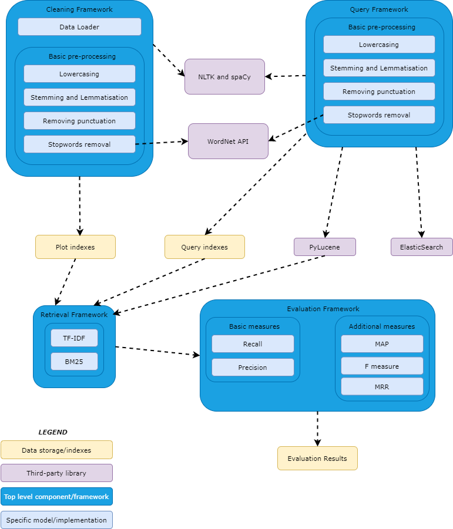

# Lyrics search engine design
# Introduction

This project deals with the implementation of retrieval models that can identify the correct song title when given a song’s lyrics, or part of the lyrics, as our query. The scope of this project is to carry out the tasks of indexing, ranking and retrieving, finding how different information retrieval models are able to rank the relevant documents, using different evaluation criteria for the results as well as creating an input interface for the user. As our data, a Kaggle lyrics dataset is used, containing a total of 79 musical genres across multiple languages.

The Python programming language is used for this project, via a Jupyter notebook on Google Colab. The main Python libraries and tools used for this project are PyLucene, PyLucene, Elasticsearch, NLTK, spaCy and WordNet.

The various components in the model can be broken down into the following:

* Data Loader: To load and convert the benchmark Lyric dataset into a workable structure for cleaning, pre-processing and indexing.

* Cleaning Framework: Python NLTK and spaCy packages will be used to clean and pre- process the dataset. The lyric text will be tokenized into words first and techniques such as lowercasing, removal of punctuations, Snowball/Porter Stemming, Lemmatization and removal of stopwords using WordNet will be applied on the tokens. Manual cleaning and use of synsets package is also necessary to take care of the slang terms in the lyrics.

* Indexing Framework: For each of the tokens, inverted indices will be computed.

* Query Processor Framework: The cleaning and indexing steps will be performed for the queries like on the dataset.

* Retrieval Framework: After the query processing is completed, retrieval models will be applied and compared. It will contain the BM25 and Vector Space Model implementations. PyLucene will be used to compute the relevance of each document to the query.

* Evaluation Framework: The search results are evaluated on the basis of multiple metrics including Precision (amount of retrieved plots that are actually relevant to the query) Recall (amount of relevant songs retrieved), MAP (Mean Average Precision), F-measure (Harmonic Mean of Precision and Recall) and MRR (Mean Reciprocal Rank@K - a metric which considers only the position of the first relevant document returned in the first K documents for each query).

Below an architectural diagram of the project is shown:

